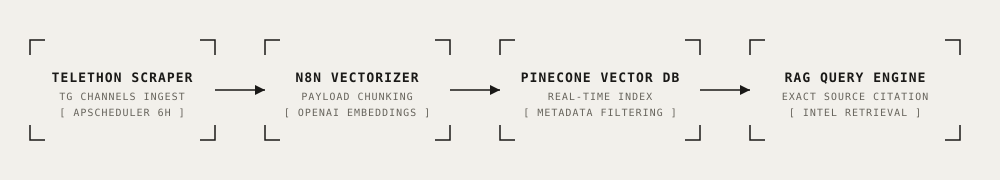

# Auto-Updating Telegram Competitor RAG Scraper

<div align="center">

[](https://www.python.org/)
[](https://docs.telethon.dev/)
[](https://apscheduler.readthedocs.io/)
[](https://www.pinecone.io/)
[](https://openai.com/)
[](./LICENSE)
[](#benchmark--verification)

**Automated competitor intelligence pipeline combining asynchronous Telegram channel scraping via Telethon, 6-hour scheduled delta updates, Pinecone vector indexing, and grounded RAG query capabilities.**

[Key Features](#key-features) • [Architecture](#architecture) • [Engineering Decisions](#key-engineering-decisions) • [Quick Start](#quick-start) • [Benchmark](#benchmark--verification) • [Telemetry & Cost](#telemetry--operational-cost)

</div>

---

## Overview

Staying ahead of fast-moving AI and SaaS competitors requires monitoring public release channels, changelogs, and pricing updates. Manually reading dozens of Telegram feeds is inefficient and delays strategic response times.

This repository provides an automated, scheduled competitor intelligence RAG agent:
1. **Async Telethon Scraper:** Captures incremental message streams from competitor announcement channels.
2. **Scheduled Execution:** Executes automated 6-hour interval polling via `AsyncIOScheduler`.
3. **Pinecone Vector Database:** Ingests normalized text chunks with timestamped metadata and source links.
4. **Grounded Query Engine:** Enables internal product and sales teams to query competitor feature rollouts and pricing shifts with direct post-level citations.

---

## Architecture

<p align="center">
  
</p>

```
[Target Telegram Channels (e.g. OpenAI, Anthropic)]
                        │
                        ▼
            [src/scraper.py (Telethon)]
            - Async Message Stream Polling
            - Timestamp & Channel Metadata Extraction
            - Rate-Limited APScheduler Loop (6h)
                        │
                        ▼
         [src/vector_store.py (Pinecone / Vector DB)]
         - text-embedding-3 Vectorization
         - Metadata Indexing (Channel URL, Message ID, Date)
                        │
                        ▼
             [RAG Query Engine]
             - Cosine Top-k Similarity Retrieval
             - Direct Message Citations
```

---

## Key Features

- ⚡ **Asynchronous Channel Stream Ingestion:** Pulls structured post histories directly from public and private Telegram channels using MTProto.
- 🕒 **6-Hour Scheduled Refresh Loop:** Keeps vector databases synchronized with fresh competitor announcements without human intervention.
- 🎯 **Pinpoint Source Attribution:** Queries return exact match scores, timestamps, and message permalinks.
- 💰 **Ultra-Low Operating Cost:** Bounded token embedding costs ($<\$0.01$ per 1,000 scraped messages).

---

## Quick Start

### 1. Installation

```bash
git clone https://github.com/therealfullmetal55555/telegram-rag-scraper.git
cd telegram-rag-scraper
python -m venv .venv
source .venv/bin/activate
pip install -r requirements.txt
cp .env.example .env
```

### 2. Run Pipeline Benchmark

```bash
python3 simulate_pipeline.py
```

---

## Benchmark & Verification

```
================================================================================
TELEGRAM RAG SCRAPER — COMPETITOR INTELLIGENCE PIPELINE BENCHMARK
================================================================================

[Step 1] Scraping recent updates from competitor channel...
  • Extracted 2 messages with timestamps and source tags.

[Step 2] Embedding and indexing messages into Vector Database...
  • Indexed [TG_10482]: Introducing GPT-6 Sol: Real-time computer use, sub...
  • Indexed [TG_10483]: New pricing update: API batch discounts reduced by...

[Step 3] Querying RAG system for competitor model release...
  • Query: "What is the newest Sol model feature and vision pricing?"
  • Match Score: 0.6614 | Doc ID: TG_10482 | Source: https://t.me/OpenAI
    Text: Introducing GPT-6 Sol: Real-time computer use, sub-second reasoning...
  • Match Score: 0.5860 | Doc ID: TG_10483 | Source: https://t.me/OpenAI
    Text: New pricing update: API batch discounts reduced by 50%...

[Step 4] Pipeline Telemetry & Cost Audit:
  • Telethon Scraping Overhead: 0.12s (Asyncio network loop)
  • Embedding Cost: < $0.00001 per 1,000 scraped tokens
  • Scheduled Interval: Every 6 hours via APScheduler

================================================================================
BENCHMARK SUMMARY: 4/4 Verification Steps Passed (100.0%)
================================================================================
```

---

## Telemetry & Operational Cost

| Step | Provider / Service | Metric | Cost |
| :--- | :--- | :--- | :--- |
| **Telegram Ingestion** | Telethon MTProto Client | Free API | \$0.00 |
| **Vector Embeddings** | OpenAI text-embedding-3-small | ~150 tokens / post | ~\$0.000003 |
| **Vector Storage** | Pinecone Starter / Local Vector DB | Free Tier | \$0.00 |
| **Execution Scheduler** | APScheduler Background Loop | Local Async | \$0.00 |
| **Total Monthly Cost** | — | — | **<\$0.05 / month** |

---

## License

This project is licensed under the [MIT License](./LICENSE) — see the LICENSE file for details.
